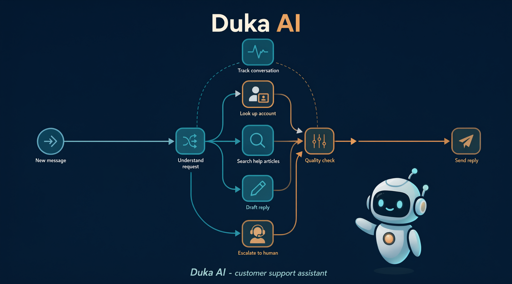
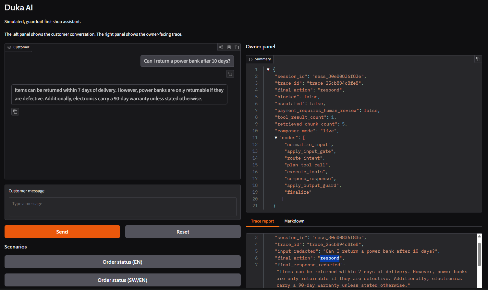

# Duka AI



Duka AI is a simulated, guardrail-first customer-support assistant for a fictional Nairobi electronics shop.

The purpose of this project is not to ship a production chatbot. The purpose is to demonstrate what a responsible business assistant pipeline looks like when guardrails, routing, retrieval, tools, escalation, and observability are treated as first-class engineering concerns.

> Duka is Swahili for shop.


---

## Status

Current implementation includes:

- uv-based Python project
- Ruff linting and formatting
- pytest suite
- typed configuration
- core schemas
- CI workflow
- fictional duka fixtures
- deterministic guardrails
- LangGraph pipeline
- structured tools
- policy retrieval
- scenario evaluation harness
- observability and redacted trace export
- Gradio demo UI
- optional live LLM composer with mock fallback

The demo is intentionally simulated.

---

## What this project demonstrates

Duka AI is designed to show:

- a guarded pipeline, not a free-running chatbot
- explicit intent routing
- retrieval over store policies
- structured tools for orders, inventory, and mock payment status
- prompt-injection resistance
- PII redaction
- escalation with context
- inspectable traces
- scenario-based demo sessions
- deterministic mock mode for reproducible demos
- optional live LLM composition behind the same guardrails

The assistant is not presented as a general-purpose agent. It is a constrained support workflow.

---

## Architecture

Duka AI is built as a pipeline. The LLM is one component inside that pipeline, not the controller of the system.

```text
customer message
  ↓
normalize input
  ↓
input gate
  ↓
intent router
  ↓
tool planner / retrieval
  ↓
tool executor
  ↓
response composer
  ↓
output guard
  ↓
respond / clarify / block / escalate
  ↓
observability
```

The pipeline is implemented with LangGraph.

---

## Guardrails

Guardrails are structural, not prompt-only.

The current system includes:

- input gate for injection, discount abuse, and PII extraction attempts
- fraud/high-risk detection for escalation routing
- deterministic intent routing
- tool argument validation
- tool execution through a registry
- retrieved policy grounding
- output guard for PII leakage, discount promises, refund promises, payment certainty, and policy contradiction
- safe fallback responses
- redacted observability artifacts

The guardrails are tested independently from the demo UI.

---

## Tools

The MVP includes four structured tools:

| Tool | Purpose |
|---|---|
| `order_lookup` | Look up fictional order status |
| `inventory_check` | Check fictional product stock |
| `payment_status` | Check mock M-Pesa payment status |
| `knowledge_base_search` | Search store policy documents |

Tools are read-only for the MVP.

The assistant does not:

- issue refunds
- issue discounts
- modify orders
- initiate payments
- access real customer records

---

## Retrieval

Policy retrieval uses BM25 over short store policy documents.

The current policy corpus includes:

- return policy
- shipping policy
- warranty policy
- mock M-Pesa payment policy

Retrieved chunks include source attribution and are passed to the output guard for validation.

---

## Live LLM mode

Duka AI supports an optional live LLM composer.

The live composer is intentionally narrow:

- it may write the customer-facing response
- it may not route
- it may not call tools
- it may not retrieve documents
- it may not decide escalation
- it may not bypass guardrails

Live mode uses an OpenAI-compatible endpoint.

Default mode:

```text
DUKA_LLM_MODE=auto
```

Behavior:

| Mode | Behavior |
|---|---|
| `mock` | Always use deterministic mock composer |
| `live` | Attempt live composer, fall back to mock on error |
| `auto` | Use live composer if configured, otherwise mock |

If the live composer times out, returns an invalid response, or fails authentication, the pipeline falls back to the deterministic mock composer.

All live responses still pass through the output guard.

---

## Non-goals

This repository does not implement:

- real WhatsApp Business API integration
- real M-Pesa/Daraja integration
- real payment processing
- real customer authentication
- real inventory backend
- real ticketing system integration
- refund or discount issuance
- multi-tenant business configuration
- production security guarantees

These are explicitly out of scope for the MVP.

---

## Tech stack

- Python 3.12
- uv
- LangGraph
- Pydantic
- Gradio
- Ruff
- pytest
- BM25 retrieval
- httpx for optional live LLM calls

---

## Quickstart

This project uses [uv](https://github.com/astral-sh/uv).

Install uv:

```bash
curl -LsSf https://astral.sh/uv/install.sh | sh
```

Install dependencies:

```bash
uv sync --dev
```

Run tests:

```bash
uv run pytest
```

Run lint:

```bash
uv run ruff check .
```

Check formatting:

```bash
uv run ruff format --check .
```

Format code:

```bash
uv run ruff format .
```

Run the demo locally:

```bash
uv run python app.py
```

The demo should open locally, usually at:

```text
http://127.0.0.1:7860
```

---

## Commands

| Task | Command |
|---|---|
| Install dependencies | `uv sync --dev` |
| Update lockfile | `uv lock` |
| Run tests | `uv run pytest` |
| Run lint | `uv run ruff check .` |
| Auto-fix lint | `uv run ruff check --fix .` |
| Format code | `uv run ruff format .` |
| Run demo | `uv run python app.py` |
| Run evaluation | `uv run python -m eval.run_eval` |
| Export demo traces | `uv run python -m observability.export_demo` |

---

## Demo scenarios

The Gradio demo includes curated scenario buttons.

Examples:

- order status in English
- order status in Swahili/English mix
- inventory check, in stock
- inventory check, out of stock
- returns policy
- mock M-Pesa pending payment
- fraud report
- direct prompt injection
- discount abuse
- PII extraction
- indirect injection scenario

Each scenario produces:

- a customer-facing response
- an owner-facing summary
- a redacted trace report
- escalation details where applicable

---

## Owner panel

The demo includes an owner-facing panel.

It shows:

- final action
- blocked status
- escalation status
- payment review status
- composer mode
- pipeline nodes executed
- redacted input
- redacted response
- gate decision
- route decision
- output guard decision
- escalation payload

The owner panel is the evidence layer. It exists to make pipeline behavior inspectable.

---

## Evaluation

The evaluation harness lives in:

```text
eval/
```

Scenario suites:

```text
eval/scenarios/benign.jsonl
eval/scenarios/swahili_english.jsonl
eval/scenarios/redteam.jsonl
```

Run the eval harness:

```bash
uv run python -m eval.run_eval
```

The report is written to:

```text
eval/reports/guarded-run.md
```

The eval runner checks:

- final action
- blocked status
- intent
- tools called
- escalation behavior
- required response text
- forbidden response text

The primary eval suite runs in deterministic mock mode by default.

---

## Observability

Observability artifacts are generated from pipeline state.

The observability layer provides:

- redacted owner reports
- JSON trace export
- Markdown trace export
- escalation payload export
- dashboard-friendly summaries

Export demo traces:

```bash
uv run python -m observability.export_demo
```

Local trace artifacts are written to:

```text
var/traces/
```

These local artifacts are ignored by git by default.

---

## Configuration

Runtime configuration is loaded from environment variables and `config.yaml`.

Key environment variables:

```env
DUKA_MODE=guarded
DUKA_LLM_MODE=auto
DUKA_LLM_PROVIDER=openai_compatible
DUKA_LLM_MODEL=gpt-4o-mini
DUKA_LLM_BASE_URL=https://api.openai.com/v1
DUKA_MAX_RESPONSE_CHARS=300
```

Optional live key:

```env
OPENAI_API_KEY=your-key
```

Do not commit real secrets.

---

## Repository layout

```text
duka-ai/
├── core/
│   ├── config.py
│   ├── fixtures.py
│   ├── schemas.py
│   ├── text.py
│   ├── guardrails/
│   ├── llm/
│   └── pipeline/
├── tools/
├── rag/
├── eval/
├── observability/
├── ui/
├── data/
├── tests/
├── app.py
├── config.yaml
├── pyproject.toml
└── requirements.txt
```

---

## Testing

Run the full test suite:

```bash
uv run pytest
```

Tests cover:

- fixtures
- schemas
- guardrails
- routing
- tools
- retrieval
- pipeline behavior
- eval harness
- observability redaction
- UI session actions
- live composer fallback behavior

Tests do not call live LLM providers.

---

## Security note

This is a demonstration project.

It explores guardrails against:

- direct prompt injection
- indirect prompt injection
- PII extraction
- discount abuse
- policy override attempts
- payment uncertainty
- escalation under ambiguity

It is not a production security product.

---

## Limitations

- The shop is fictional.
- Orders are fixtures.
- Payments are mocked.
- WhatsApp behavior is simulated.
- M-Pesa behavior is mocked.
- Language handling is limited and evaluated scenario by scenario.
- No live customer data is used.
- Live LLM mode is optional and should not be exposed publicly without cost and abuse controls.

---

## Development rules

This repository follows a few deliberate rules:

1. Prefer explicit pipelines over autonomous agent loops.
2. Prefer typed schemas over untyped dictionaries at module boundaries.
3. Prefer deterministic mock mode for demos and tests.
4. Prefer structured traces over print debugging.
5. Prefer project-generated evidence over external market claims.
6. No real PII.
7. No real secrets.
8. No production overclaiming.

---

## License

MIT